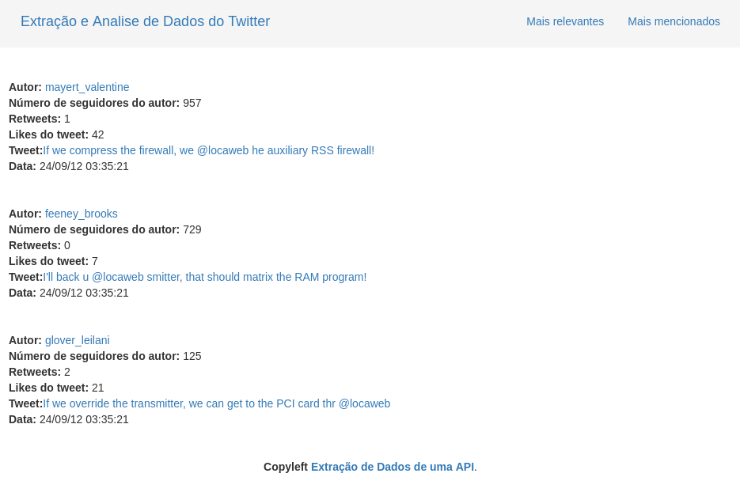

# Problema da listagem de Tweets



Você deve assumir o seguinte problema hipotético:

```
A Locaweb está planejando uma maneira de prover suporte e iniciar protocolos
para quem reclamar de seus produtos via Twitter. A idéia é listar os tweets
mais relevantes e os usuários que mais mencionam a Locaweb.
```

## Regras

Para um tweet ser elegível para a lista, ele deve estar em uma dessas categorias:

* tweets que mencionem o usuário da Locaweb
* tweets não são replies para tweets da Locaweb

Os tweets que não fazem parte dessas categorias **não** podem estar na lista.

Considerando os padrões de urgência para o problema, os tweets devem
ser ordenados de acordo com as seguintes prioridades:

1. Usuários com mais seguidores
2. Tweets que tenham mais retweets (considerar apenas o RT oficial do Twitter)
3. Tweet com mais likes

Os resultados ordenados devem conter as seguintes informações:

* screen_name (@usuario) que fez o tweet (com link para o perfil)
* Número de seguidores do autor, número de retweets e likes do tweet
* Conteúdo do tweet
* Data e hora com link para o tweet

Seu sistema deve prover dois recursos:

1. Mostra os tweets mais relevantes
2. Mostra os usuários que mais mencionaram a locaweb

Para a lista dos usuários que mais mencionarem o usuário da Locaweb,
os tweets devem ser agregados por usuário, aplicando os mesmos
critérios de ordenação dos mais relevantes.

## Implementação

Para simplificar a autenticação do Twitter e evitar limites, você **deve**
usar as respostas mockadas da API de busca do Twitter nesta URL:

http://tweeps.locaweb.com.br/tweeps

Essa API segue o mesmo formato descrito na documentação do Twitter em:
https://dev.twitter.com/docs/api/1.1/get/search/tweets

Para autenticar, envie um header HTTP chamado “Username” com o seu e-mail.

Considere apenas os tweets retornados na primeira página do web
service, ou seja, não é necessário varrer os links das próximas
páginas. Para efeito de testes, considere que o usuário da Locaweb no
Twitter tem o ID 42.

Seu sistema deve expor os recursos **em formato JSON**, nas seguintes
URIs:

/most_relevants
    Mostra os tweets mais relevantes
    
/most_mentions
    Mostra os usuários que mais mencionaram a locaweb
    
    
## Porque usar Ruby on Rails para resolver o problema?

Com o estudo dessas tecnologias, principalmente a facilidade de trabalhar com as bibliotecas do Ruby, as Gems, fica mais fácil conseguir gerenciar o que é necessário para a aplicação, criar modelos a partir de linhas de comando, facilita muito o desenvolvimento da aplicação. Além de que a comunidade de desenvolvedores disponibiliza muitos materiais.

## JSON

Utilizar o JSON para manutenção dos objetos, neste caso foi utilizado para fazer trocar de dados do Front-end para a troca de informações com o Back-end. Além de se obter o objeto e fazer o parse para controlar-los.
    
    
## Referências:
https://dev.twitter.com/rest/reference

https://imasters.com.br/artigo/23173/ruby/mineracao-de-dados-com-ruby-e-twitter/?trace=1519021197&source=single

http://geekhmer.github.io/blog/2015/02/18/ruby-on-rails-parsing-json/

https://www.distelli.com/docs/tutorials/build-and-deploy-ruby-on-rails-with-docker/
